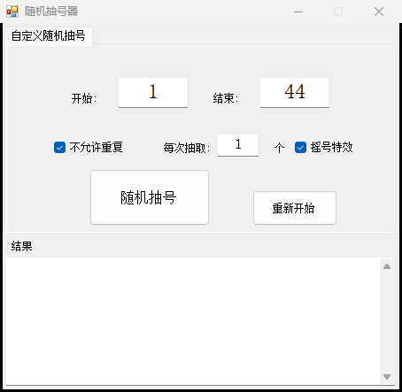
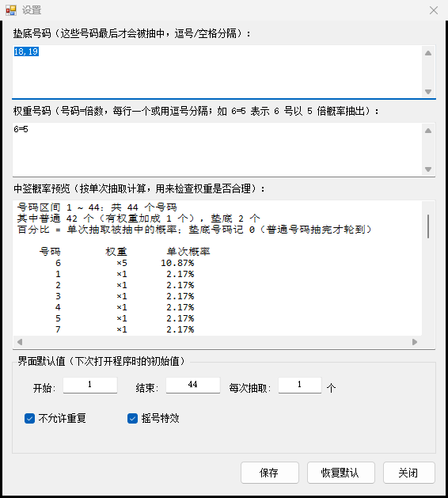

# 幸运之子——摇号机


一个**单文件**的 C# / WinForms 抽号小工具：在指定区间里抽号，支持**垫底名单**（最后才抽）、**权重**、**摇号动效**，
配置跟着 exe 走，免安装、不联网、不要管理员权限。



## 特性

- **单文件免安装**：一个 `幸运之子——摇号机.exe`（24 KB）就能跑，Windows 8/10/11 自带 .NET Framework 4.x，无需额外安装
- **垫底名单**：名单里的号码**最后才会被抽中** —— 只要还有别的号码可选就轮不到它们。
  所以「1~44 抽 44 个」能完整抽完，不会出现"总有 2 个号抽不出来"的破绽
- **权重**：`6=5` 表示 6 号以 5 倍概率被抽中，其余号码等概率
- **摇号特效**：大号红字快速滚动约 1.3 秒后落定结果
- **不允许重复**：一轮内不重复，抽完会提示"都选完啦！"
- **参数记忆**：开始 / 结束 / 每次抽取 / 两个勾选项都会记住，下次打开就是上次的样子
- **隐藏设置面板**：在「开始」框输入 `1016` 打开（沿用原程序的隐藏入口）
- **中签概率预览**：面板里实时算出每个号码的实际概率，用来检查权重配置是否合理
- 结果追加显示、一键「重新开始」，号码/权重支持中文分隔符（`,` `，` `、` `/` `;` 空格 换行）

## 快速开始

1. 拷贝 `幸运之子——摇号机.exe` 到任意目录（自带配置，放哪都行）
2. 双击运行
3. 填「开始 / 结束 / 每次抽取」→ 点 **随机抽号**

> 第一次运行会在 exe 旁边生成 `settings.ini` 记住你的设置；不需要了直接删掉即可（程序会自动重建）。

## 隐藏设置面板

在 **「开始」框里输入 `1016`**，再点 **随机抽号** → 打开设置面板（打开后「开始」框会自动恢复成默认值）。



| 区域 | 说明 |
| --- | --- |
| 垫底号码 | 最后才会被抽中的号码（不是"永远不中"），逗号/空格分隔 |
| 权重号码 | `号码=倍数`，一行一个或用逗号分隔；倍数必须是正数 |
| 中签概率预览 | 按单次抽取实时算出每个号码的概率并排序，垫底号码单列在最后 |
| 界面默认值 | 下次打开程序时的初始值：开始 / 结束 / 每次抽取 / 两个勾选项 |
| 恢复默认 | 清空垫底与权重，界面默认值回到 `1 / 44 / 1 / 勾选两项`（有二次确认） |

## 配置文件

`settings.ini` 与 exe 同目录（UTF-8，可以手动编辑，改完重启程序生效）：

```ini
Start=1
End=52
Count=1
NoRepeat=1
Effect=1
Bottom=18,19
Weights=6=5
```

- 键名支持中英文别名（`Start`/`开始`、`Bottom`/`垫底`、`Weights`/`权重` …）
- exe 所在目录不可写时（例如放进 `Program Files`），自动改用 `%APPDATA%\RandomDrawer\settings.ini`
- 旧版本把配置写在注册表 `HKCU\Software\随机抽号器`：首次运行若还没有 ini，会自动迁移过来（注册表不动）

## 自己编译 / 跑测试

双击 `build.cmd` 编译、`test.cmd` 跑测试；命令行等价于：

```powershell
.\build.ps1     # 编译到 dist\
.\test.ps1      # 编译并运行 tests\PickerTests.cs 里的 23 项断言
```

两者都用 **Windows 自带的 `csc.exe`**（`%windir%\Microsoft.NET\Framework64\v4.0.30319\csc.exe`），
**不需要安装 .NET SDK / Visual Studio**。脚本位置无关，整个文件夹可以随便挪。

## 项目结构

```text
RandomDrawer/
├─ build.cmd / build.ps1      编译（双击 build.cmd）
├─ test.cmd  / test.ps1       测试（双击 test.cmd）
├─ assets/app.ico             程序图标
├─ docs/                      截图
├─ src/
│  ├─ Program.cs              入口
│  ├─ Config.cs               号码/权重文本解析 + 旧版注册表兼容
│  ├─ Settings.cs             settings.ini 读写 + 旧配置迁移
│  ├─ Picker.cs               抽号算法（分层垫底 + 权重轮盘）
│  ├─ MainForm.cs             主窗口
│  ├─ AdminPanel.cs           隐藏设置面板（1016）
│  └─ AssemblyInfo.cs         版本信息
├─ tests/PickerTests.cs       算法与配置读写测试（23 项）
├─ reference/                 改造前的原始 exe（比对参照物）
└─ dist/                      编译产物（不入库）
```

## 来历：从只有 exe 的成品反推回源码

这个程序最早只有一个 13,824 字节的 `幸运之子——摇号机.exe`，源码丢失了。
本工程用 [dnfile](https://github.com/malwarefrank/dnfile) + [dncil](https://github.com/mandiant/dncil)
把它的 IL **逐条反汇编还原**成可编译的 C# 源码，验证与原程序等价之后，再在其上改造。

还原保真度（与原 exe 对比）：

| 项目 | 结果 |
| --- | --- |
| 控件树（类名 / 文本 / 坐标 / 尺寸） | 15 项**全部一致** |
| 主界面截图 | **像素级完全一致**（ImageMagick `AE=0`、`RMSE=0`） |
| 装配名 / CLR 版本 / 位数 / 图标 / 版本资源 | 一致（CLR v4.0.30319、32 位 PE） |

原始二进制留档在 `reference/幸运之子——摇号机.original.exe`（SHA256 `881DB614…D64B69C`），
以后想复检保真度时还用得上。逐项改动见 [`CHANGELOG.md`](CHANGELOG.md)。

## 许可

[MIT](LICENSE)
